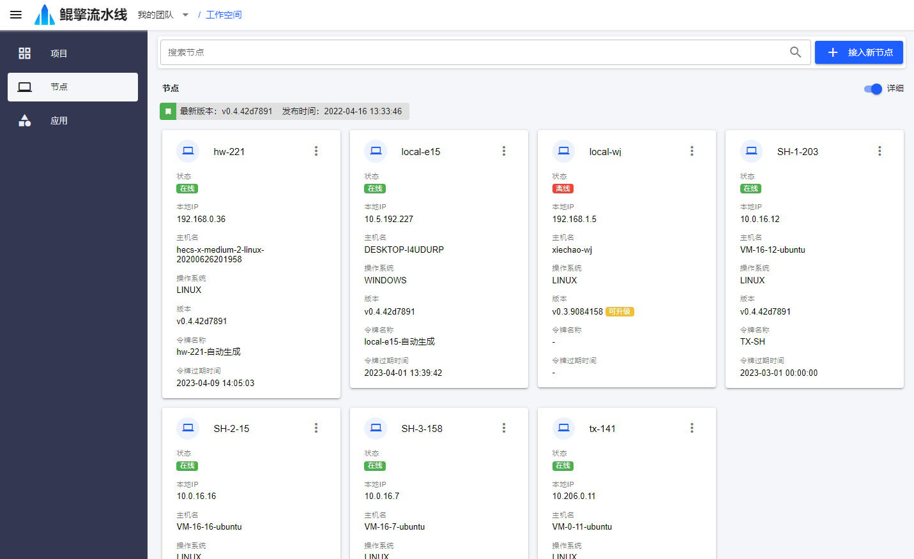

# 节点

[节点](/nav/workspace/agent) 是执行流水线步骤的实际机器，这些机器可能是用来编译的，也可能用来部署的；可能在内网，也可能在外网。

流水线通过 *准备环境* 步骤，指定接下来的其他步骤将在哪个节点上执行。该类型步骤可以作为流水线的第一个步骤，也可以放在中间，表示节点的切换。

## 接入方式

### 脚本接入
在 [脚本接入](/nav/workspace/agent/join/script)页面，自动生成接入脚本，本地运行脚本接入

### 手动接入
在 [手动接入](/nav/workspace/agent/join/manual)页面，下载节点程序，手动配置节点的唯一标识、访问令牌、工作目录等参数，安装节点服务程序

## 节点维护
节点可远程配置、重启、升级、卸载

