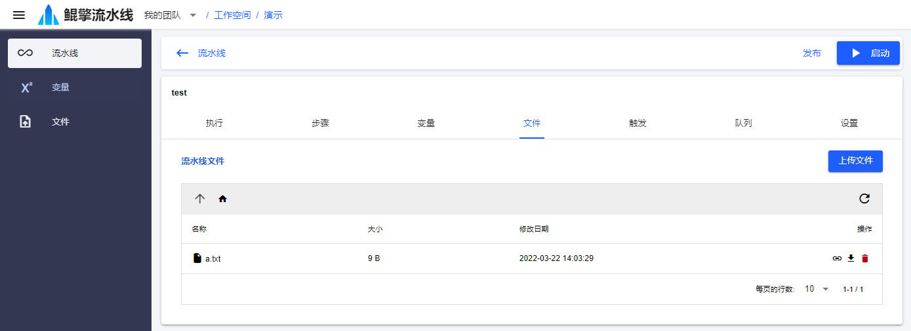

# 文件

流水线的中间过程或产出结果都可能用到文件。项目和流水线提供了文件服务。每个用户、项目、流水线都有一块文件存储空间，对应一个URL路径。

项目和流水线的 *文件* 就可以用来预先上传需要的文件，然后通过节点环境的 *文件同步* 或 *下载文件* 步骤下载到节点的工作空间中。节点也可以通过 *上传文件* 步骤，上传文件到项目、流水线、运行目录。

文件类型的变量也可以用于文件的存储和传输。

