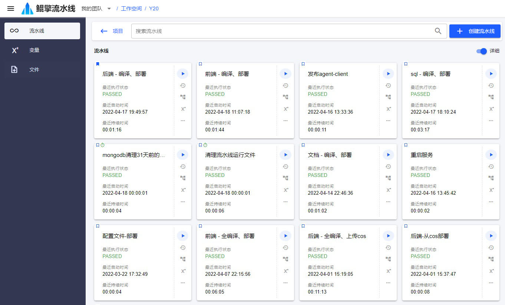

# 流水线

Y20 的核心概念就是流水线，所有功能都是围绕着流水线展开的，所以也可以把它叫做流水线的编排和运行系统。流水线包含一系列步骤及其参数。

生活中有流水线，比如做饭，步骤有买菜、洗菜、蒸饭、炒菜；去医院看病也是一条流水线，步骤有预约挂号、门诊开检查项目、拍片拿结果、回门诊开药、缴费拿药。对于软件开发人员来说，部署程序也需要流水线，把代码编译成可执行文件，再部署到远程的服务器中，这条流水线的步骤就包括：在编译机拉取代码、编译代码、上传制品，在部署机拉取制品、更新服务器文件、重启服务。其中的参数有：编译机节点、部署机节点、拉取代码时的Git仓库用户名和密码、制品上传下载路径等。

流水线的运行是自动化运维的一个问题。Y20 的目标就是能自动、完美的运行这些枯燥的流水线。

