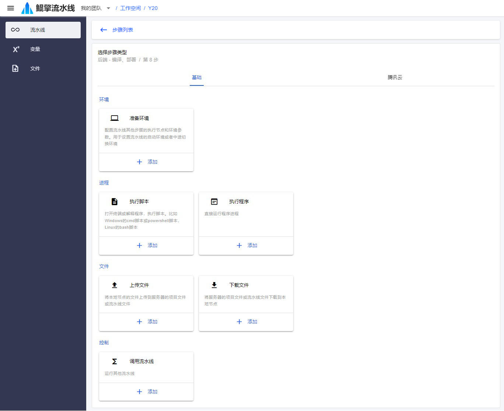

# 步骤

流水线是由一系列步骤串联起来的，步骤将按先后顺序执行，如果中间某个步骤执行失败，那么整个流水线也将运行失败。步骤类型有：*环境*、*文件*、*进程*。

## 环境步骤

用来配置执行环境的步骤是环境步骤。在它之后的其他步骤将在指定环境运行。环境的参数包含：节点、docker容器、环境变量、文件同步等。如果需要中途切换环境，需要再添加一条环境步骤，之后的步骤将在新环境下运行。环境切换后，之前的环境会销毁。

## 文件步骤

节点和服务器之间传输文件

- 上传文件：节点文件上传到服务器（项目、流水线、运行目录）
- 下载文件：服务器文件（项目、流水线）下载到节点

## 进程步骤

进程步骤包含：执行脚本、执行程序

- 执行脚本：通过打开本地终端，运行脚本
- 执行程序：直接启动程序进程