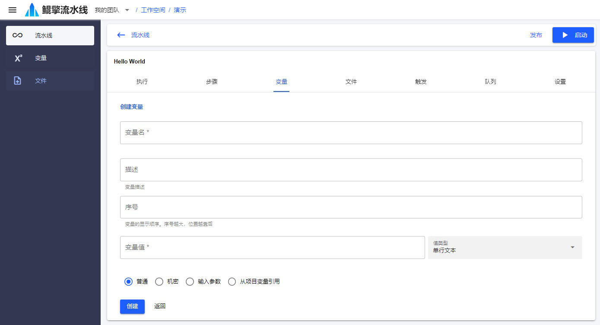

# 变量

流水线一般会需要配置一些全局定义的参数/文件，然后在各个步骤内引用；或者有些参数需要在启动时输入/上传。通过添加项目或流水线 *变量*，可实现这些需求。 



## 变量引用
变量添加后，在步骤的参数中可以通过双大括号包围变量名的方式引用：
```
{{变量名}}
```
支持引用变量的步骤参数类型有：文本、节点、节点的环境变量等。步骤执行时，参数中的 *<span v-pre>{{变量名}}</span>* 部分将会被实际的变量值所替代。

项目范围内添加的变量，会默认自动注入到流水线变量中，也可配置取消注入。

## 变量类型
- 普通：文本类型变量
- 机密：加密存储的文本类型变量
- 输入参数：在启动时输入的变量
- 从项目变量引用：引用项目变量

## 变量的值类型
- 单行文本
- 多行文本
- 文件：服务器文件URL，可以通过上传文件自动生成
- 节点：节点选择器，可以在环境步骤的节点参数中引用
