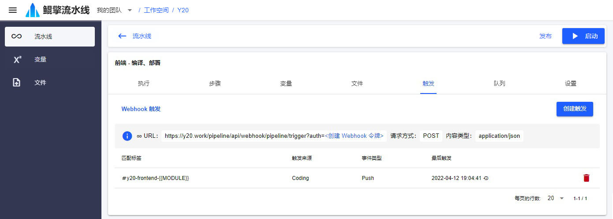

# 触发

可以配置 Git 代码仓库的 webhook，在发生 PUSH 事件时触发流水线运行。PUSH 的 COMMIT 消息中，必须通过添加 `#y20-***` 内容的方式指定要触发哪条流水线，`#y20-***` 被称作触发的匹配标签。标签中可以使用 *{{...}}* 进行位置匹配，并在输入变量中通过 *{{...}}* 引用。

## Git 仓库中 Webhook 的配置

- URL：`https://y20.work/pipeline/api/webhook/pipeline/trigger?auth=<创建的 Webhook 令牌>`
- 请求方式：`POST`
- 内容类型：`application/json`