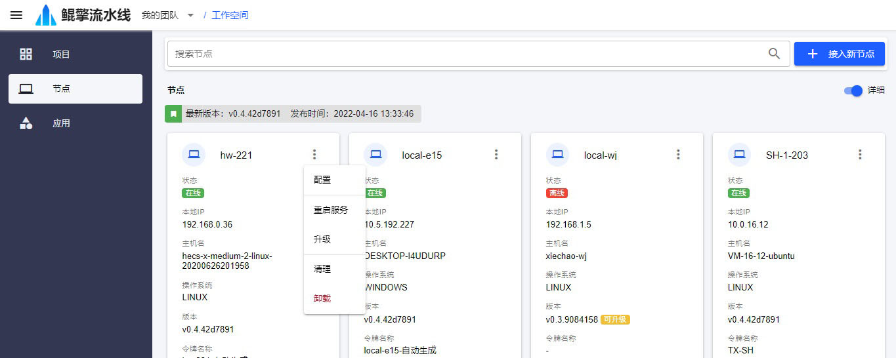

# 接入新节点
节点接入有两种方法：*脚本接入* 和 *手动接入* 。

## 脚本接入

### 1. 生成接入脚本

- 进入 [接入节点](/nav/workspace/agent/join) 页面，输入节点配置，下载接入脚本：

  - 选择节点的 **操作系统** 类型：Windows 或者 Linux
  - 输入节点的 **唯一标识**：自定义
  - 点击自动生成 **访问令牌**
  - 其余配置保持默认即可，点击 **下载脚本**

  

### 2. 执行脚本
- 打开本地终端，切换到安装目录，执行脚本，即可完成接入

  - Linux：使用 `Bash` 终端
  - Windows：使用 `Powershell` 终端。如果安全策略不允许脚本运行，请先以管理员身份打开 `Powershell` 终端，执行 `set-executionpolicy bypass`，更改脚本运行策略

  

- 在 [节点](/nav/workspace/agent) 页面，查看该节点是否成功接入

  

## 手动接入

### 1. 创建令牌
- 进入 [令牌](/nav/user/token) 页面

  

- 点击 *+创建新令牌* 按钮，进入[创建新令牌](/nav/user/token/create) 页面，输入：
  - 名称：令牌名称
  - 开始时间：令牌开始时间
  - 结束时间：令牌失效时间

  

- 点击 *创建*，将弹出包含新令牌的对话框，将令牌复制下来。**新令牌只显示一次，关闭对话框前，确保已经复制下来**。

  

### 2. 下载

- 进入节点 [手动接入](/nav/workspace/agent/join/manual) 页面

  

- 根据操作系统类型，下载 `y20-agent-client.zip`，并解压到安装目录。

  

### 3. 配置
进入 `[安装目录]/y20-agent-client/conf` 目录，用文本编辑器打开 `agent-client.yml`，修改参数：
- agentId：自定义的节点唯一标识
- accessToken：创建的访问令牌
- serverHost：服务器地址 `y20.work`
- serverRpcPort：服务器Rpc端口 `9100`
- serverRestPort: 服务器Rest端口 `443`
- serverRestUseSsl：服务器Rest是否使用SSL `true`
- dataDir：节点的本地工作目录，用于存放流水线执行过程中产生的文件 `.`

  

### 4. 安装
- 以管理员身份运行 `[安装目录]/y20-agent-client` 目录下的 `install-y20-agent-client-service`，安装节点服务 `y20-agent-client`。

- 在 [节点](/nav/workspace/agent) 页面，查看节点是否已经接入系统。

  

### 5. 维护
- 在 [节点](/nav/workspace/agent) 页面，可以对节点进行远程配置、打开终端、重启、升级或者卸载。

  