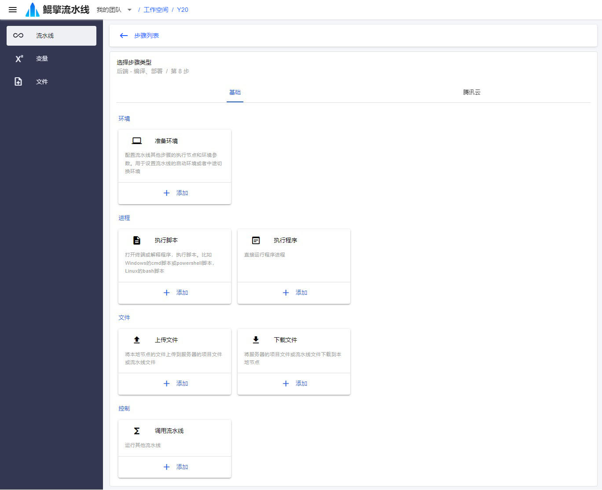

# 编排流水线

假设要编排如下一条复杂的流水线，涉及到 *节点切换* 、*文件传输* 、*输入参数* ：
- 启动前，服务器存在一个文件 `a.txt` 
- 启动时，输入一个参数 `X`
- 在机器 `A` 执行：
  - 下载文件 `a.txt`
  - 将文件 `a.txt` 内容中的字母 `X` 替换为输入参数 `X` 的值，另保存为 `b.txt`
  - 将文件 `b.txt` 上传到服务器
- 在机器 `B` 执行：
  - 下载文件 `b.txt`
  - 打印文件 `b.txt` 的内容

## 1. 创建项目
- 进入 [项目](/nav/workspace/project) 页面

  

- 点击 *+创建项目* 按钮，进入 [创建新项目](/nav/workspace/project/create) 页面，输入：

  - 名称：项目名称

  

- 点击 *创建*，创建项目

## 2. 创建流水线

- 项目创建后，自动进入 *流水线* 页面。

  

- 点击 *+创建流水线* 按钮，进入 *创建新流水线* 页面，输入：

  - 名称：流水线名称
  - 是否同时只允许启动一个运行实例：如果是，那么启动流水线时，之前的执行都必须已经结束

  

- 点击 *创建*，创建流水线。自动进入 *流水线详情* 页面，该页面有以下标签页：

  - 执行：查看执行历史
  - 步骤：编辑步骤
  - 变量：编辑变量
  - 文件：编辑流水线文件
  - 设置：编辑流水线的基础信息，配置定时执行等

  流水线创建后，默认显示 *步骤* 标签页。此时还没有添加过步骤，步骤列表为空。

  

## 3. 编辑文件
- 切换到流水线的 *文件* 标签页

  

- 本地用文本编辑器新建一个文件 `a.txt`，内容为 `===X===`
- 点击 *上传文件*，将 `a.txt` 拖动到上传组件中，点击组件右上角 *上传* 按钮，完成上传

  

- 点击 *返回*，可以看到刚才上传的文件 a.txt

  

## 4. 编辑变量
- 切换到流水线的 *变量* 标签页

  

- 点击 *创建变量* 按钮，可输入：

  - 变量名：变量的名称，在步骤参数中用 *<span v-pre>{{变量名}}</span>* 方式引用
  - 描述：变量的描述
  - 变量值：根据不同的值类型，可以输入文本、上传文件、选择节点。如果变量类型为 *输入参数* ，则不填
  - 变量值类型：单行文本、多行文本、文件、节点
  - 变量类型：普通、机密、输入参数、从项目变量引用
  - 是否必填：如果变量类型为 *输入参数* ，需要指明是否为必填

  这里变量名输入 `X`, 变量值类型选 **单行文本** ，变量类型选 **输入参数**，选中 **必填**

  

- 点击 *创建*，创建变量，回到流水线 *变量* 标签页

  

## 5. 编辑步骤
- 切换到流水线的 *步骤* 标签页，点击 *添加步骤*，进入 *选择步骤类型* 页面

  

  步骤类型分为：
  - 环境
    - 准备环境：选择执行节点，配置执行环境
  - 文件
    - 下载文件：将服务器文件下载到节点
    - 上传文件：将节点文件上传到服务器
  - 进程
    - 执行脚本：以终端方式执行脚本
    - 执行程序：以进程方式执行程序

### 5.1 步骤 1 - 准备环境 A
- 选择 **准备环境** 步骤类型，进入 *准备环境* 步骤编辑页，输入：
  - 名称：`准备环境 A`
  - 节点容器：选择已接入节点
  - 文件目录：默认自动勾选了 *同步流水线文件到工作目录*

  

- 点击 *添加* 按钮，回到流水线 *步骤* 标签页

  

### 5.2 步骤 2 - 执行脚本
- 继续添加步骤，选择 **执行脚本** 步骤类型，进入 *执行脚本* 步骤编辑页，输入：

  - 名称：`替换 X`
  - 脚本：
    ```sh
    sed 's/X/{{X}}/' a.txt > b.txt
    ```

  这里通过 *<span v-pre>{{X}}</span>* 方式引用变量 `X`，运行时会用 `X` 的值进行替换。

  

- 点击 *添加*

### 5.3 步骤 3 - 上传文件
- 继续添加步骤，选择 **上传文件** 步骤，进入 *上传文件* 步骤编辑页，输入：

  - 名称：`上传文件`
  - 源路径：`b.txt`
  - 目的所属目录：上传到项目文件仓库还是流水线文件仓库 `流水线运行`
  - 目的路径：`b.txt`
  - 目的所属目录的输出变量名：上传文件的所属目录的路径将通过这个变量名输出，以便被其他步骤引用 `DIR_B`

  

- 点击 *添加*

### 5.4 步骤 4 - 准备环境 B
- 用同 *5.1* 方法添加 `准备环境 B` 步骤。节点选择不同于 `准备环境 A` 中的节点

### 5.5 步骤 5 - 下载文件
- 继续添加步骤，选择 **下载文件** 步骤类型，进入 *下载文件* 步骤编辑页，输入：
  - 名称：`下载文件`
  - 源路径：服务端文件路径 *<span v-pre>{{DIR_B}}</span>/b.txt*
  - 目的路径：`b.txt`

  这里使用 *<span v-pre>{{DIR_B}}</span>* 引用 `b.txt` 上传后的所属目录路径

  

- 点击 *添加*

### 5.6 步骤 6 - 执行脚本
- 用同 *5.2* 方法，再添加一个 *执行脚本* 步骤，输入：
  - 名称：`打印`
  - 脚本：
    ```sh
    cat b.txt
    ```

- 点击 *添加*，回到流水线 *步骤* 标签页，完成步骤编辑

  