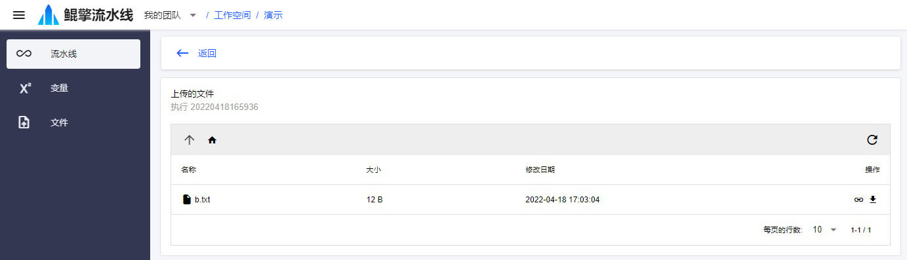

# 运行流水线
假设要运行上一节编辑完成的流水线

## 1. 启动
- 在 *流水线* 页面，找到上一节创建的流水线。点击 *▶ 按钮*，进入 *启动流水线* 页面，输入：
  - 名称：执行名称
  - 输入变量/X：`123456`
  - 调试模式：不选。如果选中，流水线每一个步骤都需要手动触发，并在结束后进入等待状态
  - 跟踪日志：选中。如果选中，流水线运行详情页面将显示并滚动到最新日志

  

- 点击 *启动*

## 2. 执行详情
- 流水线启动后，自动进入流水线 *执行详情* 页面。如果不是以 *单步调试* 方式启动，流水线将自动执行到结束。该页面可以实时观测：

  - 流水线执行的状态变化
  - 流水线步骤的日志输出

  

- 查看最后一个步骤的日志输出，是否显示文件 `b.txt` 的内容为 `===123456===`

  

## 3. 单步调试
- 如果以 *单步调试* 方式启动，启动后，流水线运行实例将处于等待状态。下一个待执行步骤的左侧将出现一个 *▶ 按钮*。点击该按钮，步骤执行。结束后，流水线再次进入等待状态。

- 所有步骤执行完成后，流水线不会立刻结束，这是为了能调试最后一个步骤。完成最后一步的调试后，点击调试工具栏的 *▶| 按钮*，将结束整个流水线的运行。

  

### 3.1 执行下一步
点击步骤名称左侧的 *▶ 按钮*，或者调试工具栏的 *▶ 下一步* 按钮，将执行下一个步骤

### 3.2 终端、浏览器
通过打开 *终端* 和 *浏览器* 可以调试当前环境和步骤。只有在 *准备环境* 步骤执行后，才能使用。

- 点击当前步骤的 *终端* 按钮，将打开当前环境的一个远程终端
- 点击当前步骤的 *浏览器* 按钮，将打开当前环境的一个文件浏览器

## 4. 停止
点击流水线 *执行详情* 页面的右侧快捷操作栏的 *■ 停止执行* 按钮，或者调试工具栏的 *■ 停止* 按钮，可以结束流水线执行

## 5. 浏览上传文件
执行结束后，在流水线 *执行详情* 页面的右侧快捷操作栏，点击 *浏览文件* 按钮，可以查看本次执行节点所上传的文件

