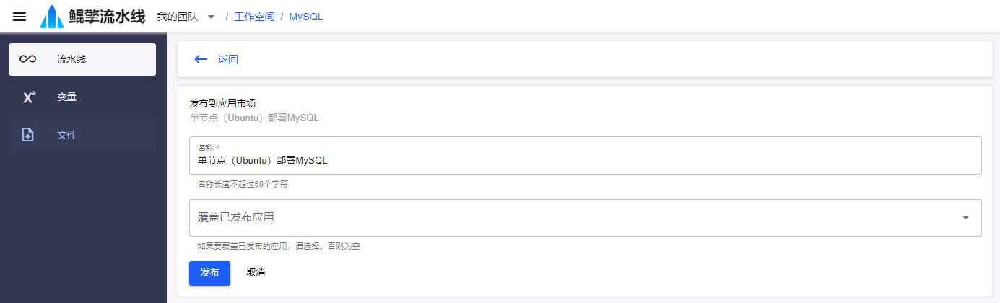
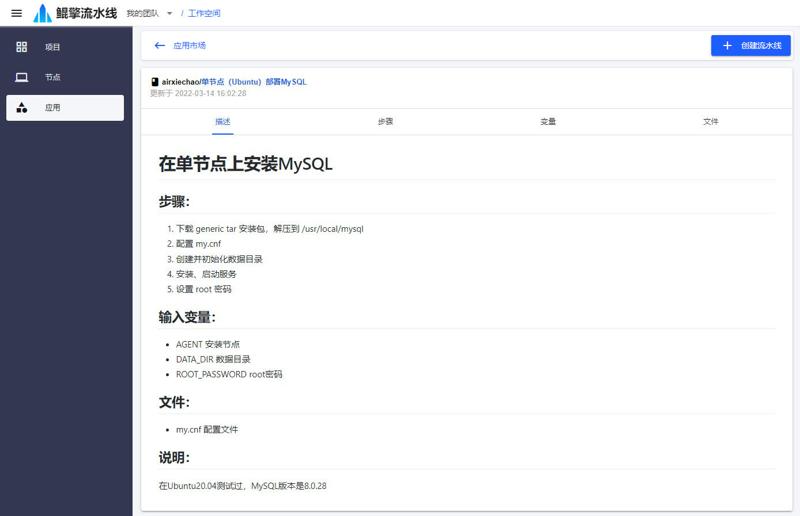
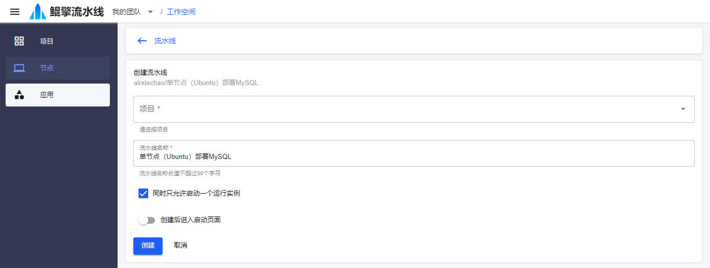

# 发布流水线
流水线可以发布为应用，应该也可以创建流水线。

## 1. 发布流水线为应用
- 在 *流水线列表* 页面，点击流水线的 *... 按钮*，在弹出菜单中选择 *发布应用*，进入 *发布到应用市场* 页面，输入：
  - 名称：应用名称
  - 是否覆盖已发布应用：如果是，将覆盖已发布应用的内容

  

- 点击 *发布*

## 2. 从应用创建流水线

- 在 *应用市场* 页面，点击应用进入 *应用详情* 页面

  

- 点击 *+ 创建流水线* 按钮，输入：
  - 项目：将在哪个项目内创建流水线
  - 流水线名称
  - 是否同时只允许启动一个运行实例
  - 是否创建后进入启动页面

  

- 点击 *创建*