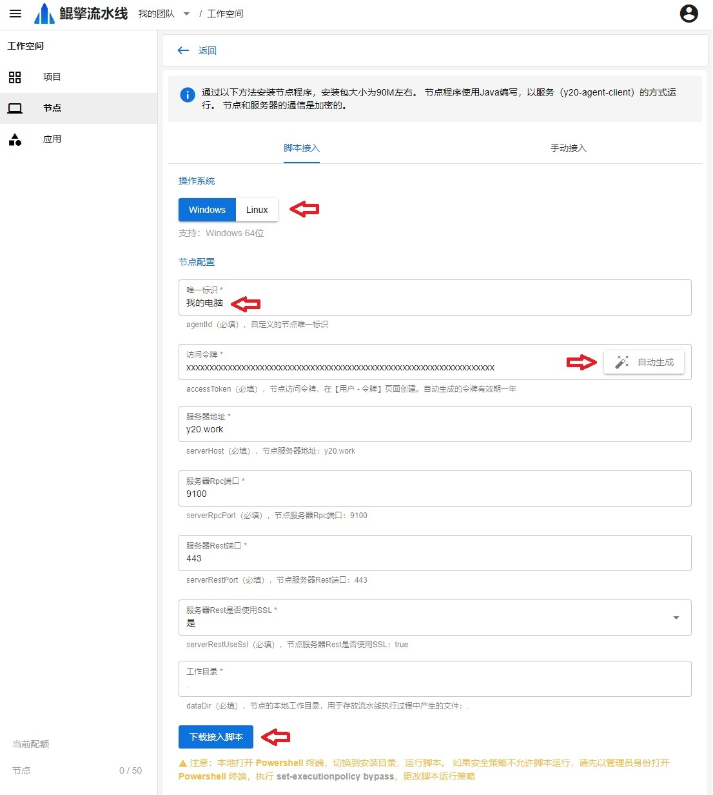
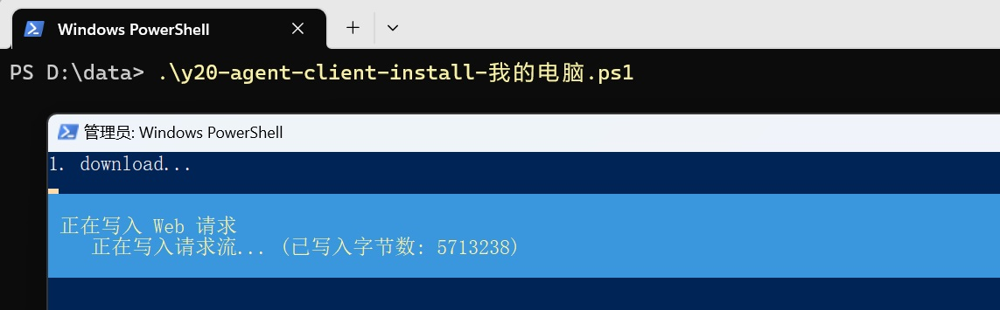
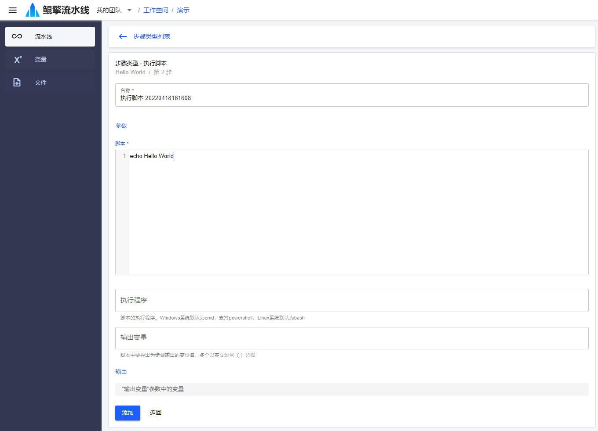

# 快速开始
编排一条打印 `Hello World` 的流水线，需要做的是：
- 接入一个节点
- 添加两个步骤：准备环境+执行脚本。

## 1. 接入一个节点
接入节点有两种方法，通过脚本接入，或者手动下载接入。这里使用脚本接入。

- 进入 [接入节点](/nav/workspace/agent/join) 页面，输入节点配置，生成接入脚本：

  - 选择节点的 **操作系统** 类型：Windows 或者 Linux
  - 输入节点的 **唯一标识**：自定义
  - 点击自动生成 **访问令牌**
  - 其余配置保持默认即可，点击 **生成脚本**

  

- 复制脚本，在节点本地打开终端，切换到安装目录，执行脚本，即可完成接入

  - Linux：使用 `Bash` 终端
  - Windows：使用 `Powershell` 终端

  

- 在 [节点](/nav/workspace/agent) 页面，查看该节点是否成功接入

  

## 2. 编排流水线
- 在 [项目](/nav/workspace/project) 页面，创建一个 *演示* 项目，接着创建一条 *Hello World* 流水线

  

- 进入流水线 *步骤* 页面，添加步骤：

  - 第一个步骤，类型 **准备环境** ，参数：
    - 节点：选择刚才接入的节点

    
    
  - 第二个步骤，类型 **执行脚本**，参数：
    - 脚本
      ```sh
      echo Hello World
      ```

    

  - 步骤列表

    

## 3. 启动流水线
- 在 *流水线* 列表页面，点击该流水线的 *▶ 执行按钮*，进入 *启动* 页面

- 该流水线不需要输入参数，直接点击 *启动* 按钮，启动流水线

- 启动后，自动进入 *执行详情* 页面，这里可以实时观测执行状态和日志输出 `Hello World`

  
